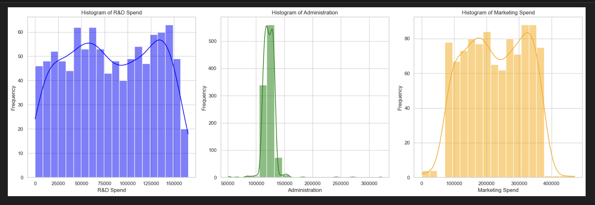
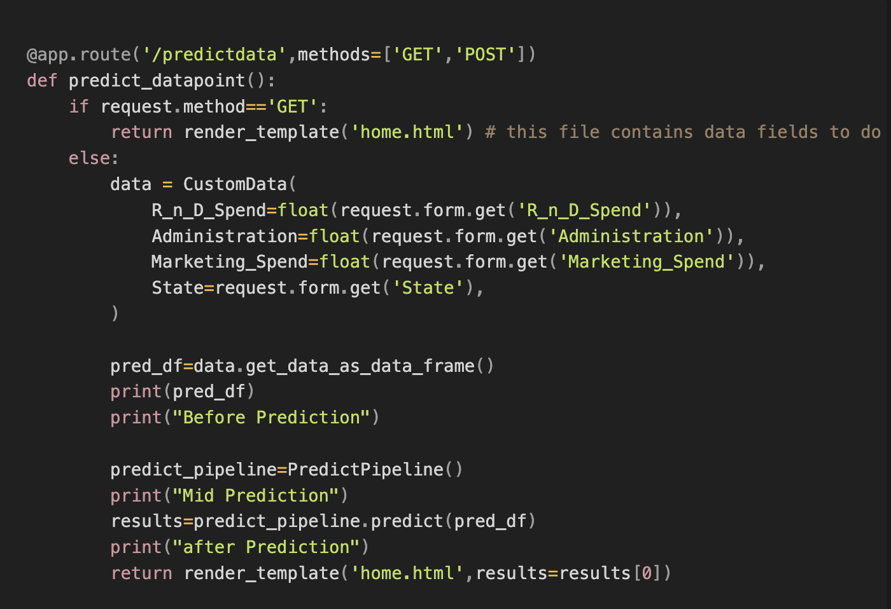
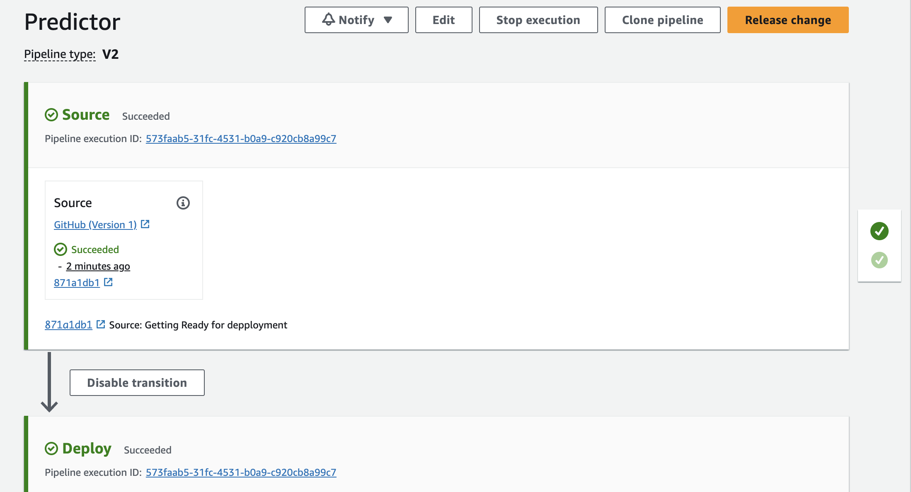

## Profit Prediction Project

<p1> The following project utilizes the linear regression model to predict the quartley profit given the R&D expeneses, Administration costs, Marketing Spend and the given state </p1>

<h1> Framework used </h1>

**STEP 1**

**Setup.py** - The whole project is based on this file the foundation config for the project Create the logger file Exception file **utils.py** to call in external packages .gitignore requirements.txt containing all the requirements

**STEP 2**

**Then create the folder flow**

src - Stages -Data ingestion Data transformation Model trainer pipelines folder Mention **init**.py so that the folder can be packaged and be called in by other files as well 

**STEP 3**

**EDA **

 example:

**STEP 4,5,6**

**Data preprocessing and ingestion**

    1. Class DataIngestionConfig : how the files will be created and saved as artifacts

    2. Class DataIngestion :
    function initiate_data_ingestion

    3. Do the train and test split and return these files for data transformation

**Data transformation**

    1. Create the transformation and preprocessing pipelines
    2. Preprocessor file should be saved as a pkl file
    3. All the transformations will be going to the pkl file
    4. Divide the numerical and categorical features
    5. Then draw the pipelines with imputers and scalers, onehotencoders

    6.Combine numerical and cat transformations together at

                def initiate_data_transformation(self, train_path, test_path):
                try:
                **Read the training and test datasets
                train_df = pd.read_csv(train_path)
                test_df = pd.read_csv(test_path)

**Data trainer**

    1.Open a folder
    2.Split the data as train and test
    3.Take the models
    4.Setting some hyperparameters.
    5.Perform grid search CV

**STEP 7**

**Web application and feeding the data to the model**

CustomData : Mapping all the input values to the backend from the html script Return all inputs as a dataframe predict function to gather the files and transformers

app.py - processing the incoming dat incorporation with the pipeline file

 

 

**STEP 8**

**Cloud Deployment**

The python.config file will build the application

Setup the EBS application Setup Pipelines Code pipeline Connect your github and the repo needed In build stage, jenkins can be integrated In deploy stage connect the github with EBS app name

And create the pipeline

Any change the codepipeline will adjust with and the application accessible link is in Deploy section that gets you to EBS and to browser

